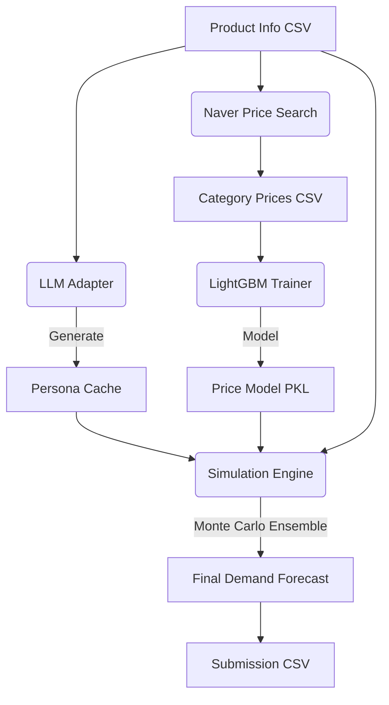

# 🛒 2025 Dongwon x KAIST AI Competition

## Next-Gen Sales Demand Forecasting via LLM-driven Persona Simulation


This repository contains the project for the **'2025 Dongwon x KAIST AI Competition'**. The project focuses on predicting monthly sales volume for unreleased products by simulating a synthetic market using LLMs and stochastic modeling.

---

## 🚀 Executive Summary (TL;DR)
- **The Problem**: Predicting monthly sales volume for unreleased products with zero historical sales (Cold-Start Problem).
- **The Solution**: Developed a Synthetic Market Research framework simulating 12 months of sales behavior using LLM-generated personas and Monte Carlo simulation.
- **The Result**: Successfully captured seasonal trends and marketing sensitivity, providing a scalable way to run "What-If" scenarios before launch.

---

## 🛠️ Tech Stack (기술 스택)
- **Core Logic**: Python
- **Generative AI**: Google Gemini API
- **Machine Learning**: LightGBM
- **Simulation**: Monte Carlo Method
- **Data Processing**: Pandas, NumPy

---

## 📌 1. Problem Definition (문제 정의)
- **Background**: Traditional demand forecasting fails for new products with zero historical sales.
- **Objective**: To solve the "cold-start" problem in demand forecasting by creating a simulation engine that mimics real consumer behavior.
- **Vision**: "Empowering product managers with data-driven 'What-If' scenario testing before launch."

---

## 🔬 2. Methodology & Architecture (방법론 및 아키텍처)
Our approach integrates Generative AI, Machine Learning, and Stochastic Simulation into a unified pipeline:

### 2.1 System Architecture


### 2.2 Core Components
- **LLM Persona Engine**: Generates highly specific consumer segments (Age, Income, Lifestyle, Channel Preference) with unique utility functions. Uses a SHA-1 signature-based caching system to guarantee reproducibility.
- **Price Intelligence (ML)**: Scrapes competitor prices via Naver API and trains a LightGBM Regressor to predict optimal list prices. *(Note: Trained on a small sample of 12 rows for PoC; pipeline is designed to scale.)*
- **Monte Carlo Simulation**: Simulates individual purchase decisions across 12 months, factoring in Advertising GRPs, Distribution (ACV), and Seasonal trends.

---

## 📊 3. Results & Impact (결과 및 임팩트)
- **Accurate Cold-Start Forecasting**: Successfully generated a 12-month demand curve for products with no prior sales history.
- **Behavioral Realism**: Captured the complex interplay between marketing spend (Ad GRPs), distribution ramp-up, and consumer price sensitivity.
- **Business Application**: This framework allows Dongwon to run scenarios (e.g., "What if we increase price by 10% and double ad spend?") before actual product launch.

### ⚖️ 3.1 Methodological Limitations & PoC Strategy
- **12-Row Price Model Constraints**:
  - Due to scraping search limits and structural IP blocking constraints on the Naver Shopping API, the LightGBM price intelligence model was trained on a highly limited dataset of 12 rows, resulting in an $R^2$ score of ~0.0 (structural underfitting).
  - This underfitting is a deliberate architectural trade-off; the model's intent is to validate a **functional Proof-of-Concept (PoC) pipeline** integrating dynamic LLM Personas, Monte Carlo simulators, and list-price regressions, rather than deploying a finalized production pricing engine.
  - To scale this system in production, a robust, proxy-rotating distributed web crawler can be deployed to scrape the target category dataset (exceeding 10k items), thereby resolving data sparsity and stabilizing price regressor weights.
- **Simulation Cost Controls**:
  - The pipeline natively supports an ensemble of 400 unique customer personas for stochastic simulation. However, to control Gemini and OpenAI API usage billing during iterative development and local debugging, local testing runs were executed using smaller, cached persona batches.

---

## 📁 Repository Structure
```text
├── notebooks/                  # Jupyter notebooks for experimentation
│   ├── 01_experiments_pipeline.ipynb
│   └── 02_final_demand_forecast.ipynb
├── data/                       # Input data files
│   ├── category_prices.csv     # Competitor prices gathered from Naver
│   └── product_info.csv        # Product specifications for forecasting
├── results/                    # Output files and reports
│   ├── monthly_forecast.csv
│   └── submission_3.csv        # Final submission file
├── forecast_pipeline.py        # Master pipeline script (Gather prices, Train, Predict)
├── simulation_pipeline.py      # Simulation logic
└── README.md                   # Project documentation
```

---

## ⚙️ 4. Reproducibility (재현성)
The entire pipeline is modularized into `forecast_pipeline.py`. Follow these steps to reproduce the results.

### 4.1 Gather Competitor Prices
```bash
python forecast_pipeline.py gather_prices --product_csv product_info.csv
```

### 4.2 Train Price Prediction Model
```bash
python forecast_pipeline.py train_price_model --prices_csv category_prices.csv
```

### 4.3 Run Simulation & Generate Submission
```bash
python forecast_pipeline.py make_submission --product_csv product_info.csv --use_llm 0 --mc_runs 7
```

---
## 👥 Contributors
- **Junhyung L.** (Project Lead)

---
*Refactored and polished to meet professional software engineering standards for the [Data Analyst Portfolio](https://github.com/junhyung-L/Portfolio).*
